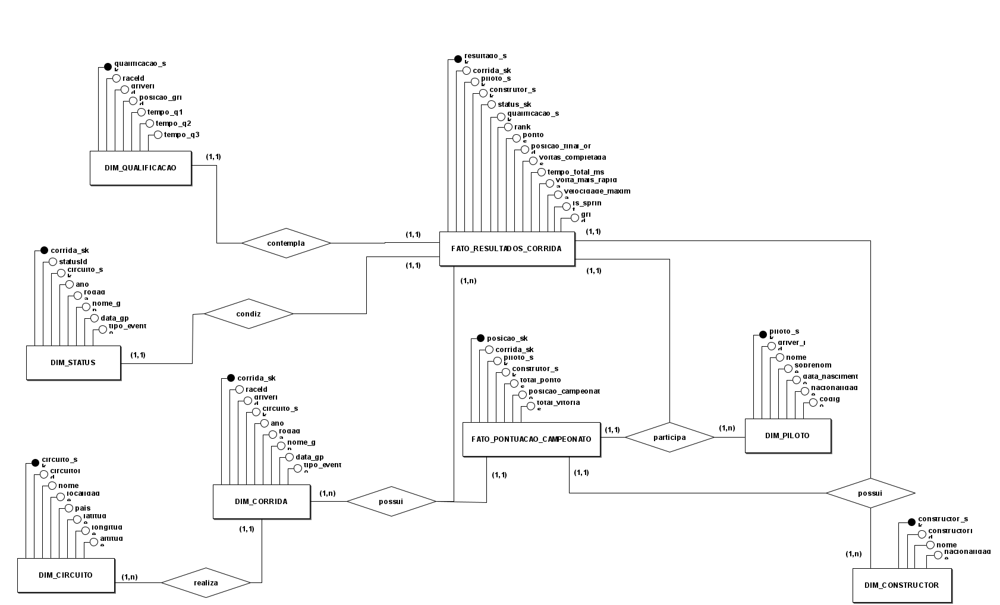

# Modelo Entidade-Relacionamento (ME-R) - Camada Silver

## Visão Geral

Este documento apresenta o modelo entidade-relacionamento (ME-R) para a camada Silver do projeto analítico sobre a Formula-1, baseado nos dados processados e enriquecidos do lakehouse de dados, seguindo o padrão de modelagem especificado.

## Análise dos Dados Processados

### Estrutura da Camada Silver

| Arquivo (Camada Silver)            | Registros | Colunas | Modelo   |
|-----------------------------------|------------|----------|----------|
| fato_resultados_corrida.csv       | 27.119     | 16       | FATO     |
| fato_pontuacao_campeonato.csv     | 48.254     | 7        | FATO     |
| dim_status.csv                    | 139        | 3        | DIMENSÃO |
| dim_circuito.csv                  | 77         | 8        | DIMENSÃO |
| dim_construtor.csv                | 212        | 4        | DIMENSÃO |
| dim_piloto.csv                    | 861        | 7        | DIMENSÃO |
| dim_qualificacao.csv              | 10.494     | 8        | DIMENSÃO |
| dim_corrida.csv                   | 1.125      | 8        | DIMENSÃO |

## Entidades Dimensão

1. **DIM_PILOTO**: Detalhes bibliográficos dos pilotos.
2. **DIM_CONSTRUCTOR**: Detalhes das equipes.
3. **DIM_CORRIDA**: Informações do evento de corrida.
4. **DIM_CIRCUITO**: Detalhes geográficos e de localização dos circuitos.
5. **DIM_STATUS**: Descrição dos status de fim de corrida/abandono.
6. **DIM_QUALIFICAÇÃO**: Resultados detalhados da sessão de qualificação.

## Entidades Fato

1. **FATO_RESULTADOS_CORRIDA**: Consolida os resultados finais do Grande Prêmio (GP) e da Sprint, utilizando chaves substitutas para as dimensões.
2. **FATO_PONTUACAO_CAMPEONATO**: Armazena a evolução das pontuações e posições ao longo da temporada para pilotos e contrutores.

## Atributos

`FATO_RESULTADOS_CORRIDA` (**resultado_sk**, #corrida_sk, #piloto_sk, #construtor_sk, #status_sk, #grid, #rank, pontos, posicao_final_ordenada, voltas_completadas, tempo_total_ms, volta_mais_rapida, velocidade_maxima, is_sprint)

`FATO_PONTUACAO_CAMPEONATO` (**posicao_sk**, #corrida_sk, #piloto_sk, #construtor_sk, total_pontos, posicao_campeonato, total_vitorias)

`DIM_PILOTO` (**piloto_sk**, #driverId, nome, sobrenome, data_nascimento, nacionalidade, codigo)

`DIM_CONSTRUTOR` (**constructor_sk**, #constructorId, nome, nacionalidade)

`DIM_CIRCUITO` (**circuito_sk**, #circuitId, nome, localidade, país, latitude, longitude, altitude)

`DIM_STATUS` (**status_sk**, #statusId, descricao_status)

`DIM_CORRIDA` (**corrida_sk**, #raceId, #circuito_sk, ano, rodada, nome_gp, data_gp, tipo_evento)

`DIM_QUALIFICACAO` (**qualificacao_sk**, #raceId, #driverId, posicao_grid, tempo_q1, tempo_q2, tempo_q3)

## Diagrama Entidade-Relacionamento

## Detalhamento das Entidades (Camada SILVER - Modelo Dimensional)

### Dimensões (Contexto Analítico)

### 1. DIM_PILOTO

**Descrição**: Dimensão do Piloto. Criada a partir de `drivers.csv`, otimizada para análise e joins.

**Atributos**:
- `_piloto_sk_` (PK): Chave Substituta para otimização de joins.
- `#driverId`: **Chave Natural** para *Drill-Through* e auditoria na Camada Bronze.
- `nome_completo`: (Derivado: `forename` + `surname`).
- `data_nascimento`, `nacionalidade`, `codigo`.

### 2. DIM_CONSTRUTOR

**Descrição**: Dimensão do Construtor/Equipe. Criada a partir de `constructors.csv`.

**Atributos**:
- `_construtor_sk_` (PK): Chave Substituta.
- `#constructorId`: **Chave Natural** para *Drill-Through*.
- `nome_equipe`, `nacionalidade`.

### 3. DIM_CIRCUITO

**Descrição**: Dimensão do Circuito. Criada a partir de `circuits.csv`. Liga-se à `DIM_CORRIDA` (Snowflake).

**Atributos**:
- `_circuito_sk_` (PK): Chave Substituta.
- `#circuitId`: **Chave Natural** para *Drill-Through*.
- `nome`, `localidade`, `país`, `latitude`, `longitude`.

### 4. DIM_STATUS

**Descrição**: Dimensão do Status de Fim de Corrida. Criada a partir de `status.csv`.

**Atributos**:
- `_status_sk_` (PK): Chave Substituta.
- `#statusId`: **Chave Natural** para *Drill-Through*.
- `descricao_status`.

### 5. DIM_CORRIDA

**Descrição**: Dimensão do Evento de Corrida. Combinação de `races.csv` e `seasons.csv`.

**Atributos**:
- `_corrida_sk_` (PK): Chave Substituta.
- `#raceId`: **Chave Natural** para *Drill-Through*.
- `#circuito_sk` (FK): Referência à `DIM_CIRCUITO` (Snowflake).
- `ano`, `rodada`, `nome_gp`, `data_gp`.
- `tipo_evento`: (Derivado: GP, Sprint, etc.).

### 6. DIM_QUALIFICACAO

**Descrição**: Dimensão para detalhes da sessão de qualificação. A chave primária natural (`qualifyId`) é usada como Dimensão Degenerada no Fato.

**Atributos**:
- `_qualificacao_sk_` (PK): Chave Substituta.
- `#qualifyId`: **Chave Natural** (Usada como DD na tabela fato).
- `#raceId`, `#driverId`: Chaves para ligação com a Bronze.
- `tempo_q1`, `tempo_q2`, `tempo_q3`.

### Fatos (Métricas Analíticas)

### 1. FATO_RESULTADOS_CORRIDA

**Descrição**: Tabela Fato principal que consolida resultados (GP e Sprint) para análise de performance.

**Atributos**:
- `_resultado_sk_` (PK): Chave Substituta.
- `#corrida_sk` (FK): Referência à `DIM_CORRIDA`.
- `#piloto_sk` (FK): Referência à `DIM_PILOTO`.
- `#construtor_sk` (FK): Referência à `DIM_CONSTRUTOR`.
- `#status_sk` (FK): Referência à `DIM_STATUS`.
- **`#qualifyId` (DD)**: **Dimensão Degenerada** (Chave Natural de `qualifying.csv`).
- `grid`: Posição inicial no grid.
- `pontos`: Pontos conquistados (métrica).
- `tempo_total_ms`: Duração total (métrica).
- `volta_mais_rapida_ms`: Tempo da volta mais rápida (métrica).
- `is_sprint`: Flag (True/False) para diferenciar eventos.

### 2. FATO_POSICOES_CAMPEONATO

**Descrição**: Tabela Fato transacional que rastreia a evolução das posições no campeonato ao longo da temporada.

**Atributos**:
- `_posicao_sk_` (PK): Chave Substituta.
- `#corrida_sk` (FK): Referência à `DIM_CORRIDA`.
- `#piloto_sk` (FK): Referência à `DIM_PILOTO`.
- `#construtor_sk` (FK): Referência à `DIM_CONSTRUTOR`.
- `total_pontos`: Pontuação acumulada (métrica).
- `posicao_campeonato`: Posição final após o evento (métrica).
- `total_vitorias`: Número de vitórias acumuladas (métrica).

---