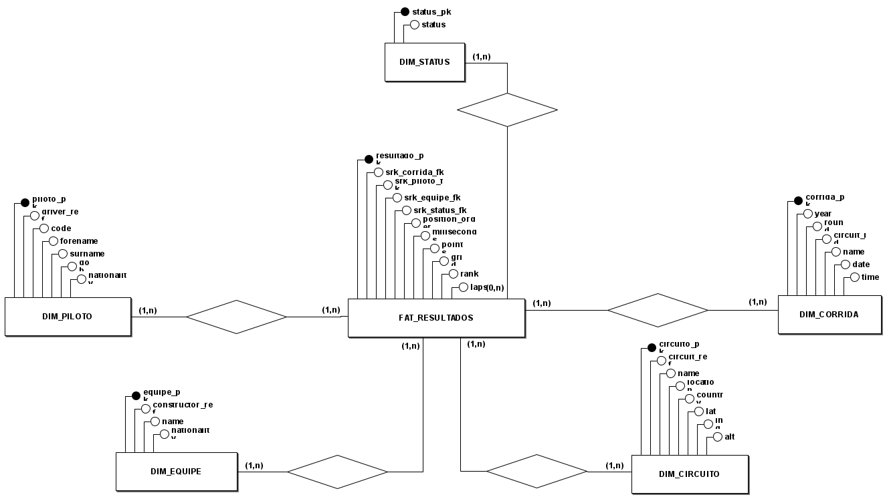
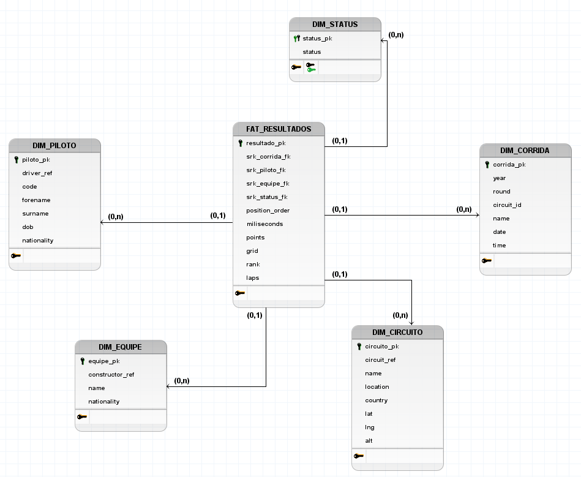

# Modelo Entidade-Relacionamento (MER)

### Entitades

FAT_RESULTADOS

DIM_PILOTO

DIM_EQUIPE

DIM_CIRCUITO

DIM_STATUS

DIM_CORRIDA

# Atributos

#### DIM_PILOTO 
(piloto_pk, driver_ref, code, forename, surname, dob, nationality)

#### DIM_EQUIPE 
(equipe_pk, constructor_ref, name, nationality)

#### DIM_CIRCUITO 
(circuito_pk, circuit_ref, name, location, country, lat, lng, alt)

#### DIM_STATUS 
(status_pk, status)

#### DIM_CORRIDA 
(corrida_pk, year, round, circuit_id, name, date, time)

#### FAT_RESULTADOS 
(resultado_pk, srk_corrida_fk, srk_piloto_fk, srk_equipe_fk, srk_status_fk, grid, position_order, points, laps, milliseconds, rank)

# Relacionamentos 

| Relacionamento | Cardinalidade | Descrição |
| :--- | :--- | :--- |
| **DIM_PILOTO** → **FAT_RESULTADOS** | **1:N** (Um para Muitos) | Um piloto possui **múltiplos** resultados registrados (uma linha para cada corrida que participou). |
| **DIM_EQUIPE** → **FAT_RESULTADOS** | **1:N** | Uma equipe (construtora) aparece em **múltiplos** resultados de seus pilotos ao longo do tempo. |
| **DIM_STATUS** → **FAT_RESULTADOS** | **1:N** | Um tipo de status (ex: "Finished" ou "Accident") pode ser o resultado final de **múltiplas** corridas. |
| **DIM_CORRIDA** → **FAT_RESULTADOS** | **1:N** | Uma corrida possui **múltiplos** resultados, um para cada piloto que competiu. |
| **DIM_CIRCUITO** → **DIM_CORRIDA** | **1:N** | Um circuito (pista) pode sediar **múltiplas** corridas (eventos) ao longo dos anos. |

# Diagrama Entidade Relacionamento (DER)

# Diagrama Lógico de Dados (DLD)

